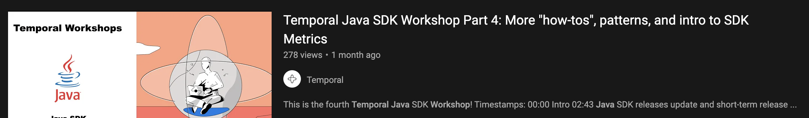

# Temporal Java SDK Workshops

## Notable Temporal Links

* [Website](https://temporal.io/)
* [Community Forum](https://community.temporal.io/)
* [Slack](https://temporal.io/slack)
* [YouTube](https://temporal.io/youtube)
* [Meetups](https://temporal.io/meetup)

## Chapters

### 1. [Getting Started](src/main/java/io/workshop/CHAPTER1.md)

 

* [Section 1 - Set up](src/main/java/io/workshop/CHAPTER1.md#section-1)
* [Section 2 - Workflows](src/main/java/io/workshop/CHAPTER1.md#section-2)
* [Section 3 - Workers](src/main/java/io/workshop/CHAPTER1.md#section-3)
* [Section 4 - Activities ](src/main/java/io/workshop/CHAPTER1.md#section-4)
* [Section 5 - Child Workflows](src/main/java/io/workshop/CHAPTER1.md#section-5)
* [Section 6 - Testing](src/main/java/io/workshop/CHAPTER1.md#section-6)

### 2. [Client APIs, Versioning and Error Handling](src/main/java/io/workshop/CHAPTER2.md)

 

* [Section 1 - Client APIs continued](src/main/java/io/workshop/CHAPTER2.md#Section-1)
* [Section 2 - Sleep Duration](src/main/java/io/workshop/CHAPTER2.md#Section-2)
* [Section 2 - Versioning](src/main/java/io/workshop/CHAPTER2.md#Section-3)
* [Section 3 - Error Handling](src/main/java/io/workshop/CHAPTER2.md#Section-4)
* [Section 5 - Dynamic Workflow / Activities](src/main/java/io/workshop/CHAPTER2.md#Section-5)

### 3. [Workflow, Activity Types, ContinueAsNew, Client error handling and more](src/main/java/io/workshop/CHAPTER3.md)

 

* [Section 1 - Types](src/main/java/io/workshop/CHAPTER3.md#Section-1)
* [Section 2 - Typed vs untyped stubs](src/main/java/io/workshop/CHAPTER3.md#Section-2)
* [Section 3 - Dynamic signals and queries with typed stubs](src/main/java/io/workshop/CHAPTER3.md#Section-3)
* [Section 4 - Client errors and setting up SSL/mTLS](src/main/java/io/workshop/CHAPTER3.md#Section-4)
* [Section 5 -ContinueAsNew and signals](src/main/java/io/workshop/CHAPTER3.md#Section-5)

### 4. [How-tos, Patterns, SDK Metrics](src/main/java/io/workshop/CHAPTER4.md)

 

* Intro - Java SDK Updates / Roadmap - Dmitry

* [Section 1 - More "how tos" and "gotchas"](src/main/java/io/workshop/CHAPTER4.md#Section-1)
  * Parallel activity exec - error handling
  * Don't use native Java Thread in wf code and why ([workflow constraints](https://docs.temporal.io/docs/java/workflows#workflow-implementation-constraints))
  * Disable signals? Why would you want to?
  * Cron timezone
  * More error handling fun

* [Section 2 - Patterns](src/main/java/io/workshop/CHAPTER4.md#Section-2)
  * Polling
  * Recovery / Fallback
  * Pipeline (one workflow at a time)
  * Busy Loop with wait
    
* [Section 3 - SDK Metrics Intro](src/main/java/io/workshop/CHAPTER4.md#Section-3)
  * Setting up ([Docker compose repo](https://github.com/tsurdilo/my-temporal-dockercompose))
    * Prometheus scrape config
    * Grafana SDK dashboard
  * Enabling SDK metrics (Worker, "Starter")
  * Showing dashboard
  * [Worker tuning guide](https://docs.temporal.io/docs/operation/how-to-tune-workers/)

### 5. [More Patterns, Cancellation, Interceptors, Workflow Execution+History and more ](src/main/java/io/workshop/CHAPTER5.md)

* [Section 1 - More Patterns / Cancellation/ Signals / Interceptors](src/main/java/io/workshop/CHAPTER5.md#Section-1)
  * Bulk Request
  * Cascade wait for cancellation
  * Handle multiple distinct signals in order
  * Break workflow determinism + replay + reset
  * Logging - logback patterns and MDC context
  * Payload converter and no-args constructor - serialization/deserialization
  
* [Section 2 - Workflow Execution + History](src/main/java/io/workshop/CHAPTER5.md#Section-2)
  
## 6. Things planned for future Workshops
* Let us know what you would like to have covered (open issue in this repo or ping us on slack!)

