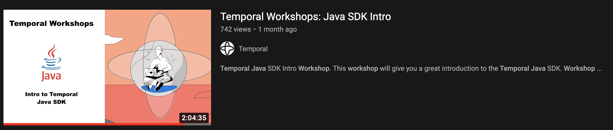
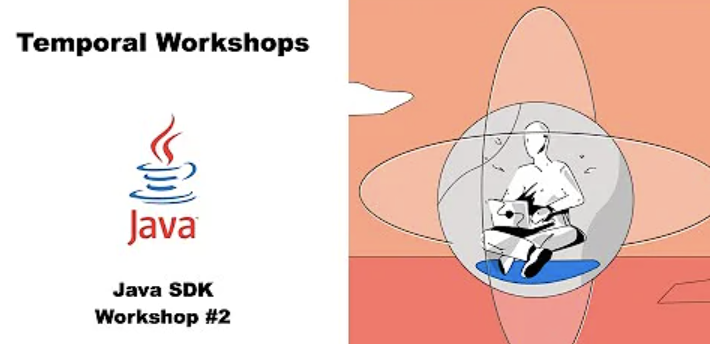

# Temporal Java SDK Workshop

## Notable Temporal Links

* [Website](https://temporal.io/)
* [Community Forum](https://community.temporal.io/)
* [Slack](https://temporal.io/slack)
* [YouTube](https://temporal.io/youtube)
* [Meetups](https://temporal.io/meetup)

## Chapters

### 1. [Getting Started](src/main/java/io/workshop/CHAPTER1.md)

 

* [Section 1 - Set up](src/main/java/io/workshop/CHAPTER1.md#section-1)
* [Section 2 - Workflows](src/main/java/io/workshop/CHAPTER1.md#section-2)
* [Section 3 - Workers](src/main/java/io/workshop/CHAPTER1.md#section-3)
* [Section 4 - Activities ](src/main/java/io/workshop/CHAPTER1.md#section-4)
* [Section 5 - Child Workflows](src/main/java/io/workshop/CHAPTER1.md#section-5)
* [Section 6 - Testing](src/main/java/io/workshop/CHAPTER1.md#section-6)

### 2. [Client APIs, Versioning and Error Handling](src/main/java/io/workshop/CHAPTER2.md)

 

* [Section 1 - Client APIs continued](src/main/java/io/workshop/CHAPTER2.md#Section-1)
* [Section 2 - Sleep Duration](src/main/java/io/workshop/CHAPTER2.md#Section-2)
* [Section 2 - Versioning](src/main/java/io/workshop/CHAPTER2.md#Section-3)
* [Section 3 - Error Handling](src/main/java/io/workshop/CHAPTER2.md#Section-4)
* [Section 5 - Dynamic Workflow / Activities](src/main/java/io/workshop/CHAPTER2.md#Section-5)

### 3. [Workflow, Activity Types, ContinueAsNew, Client error handling and more](src/main/java/io/workshop/CHAPTER3.md)

 

* [Section 1 - Types](src/main/java/io/workshop/CHAPTER3.md#Section-1)
* [Section 2 - Typed vs untyped stubs](src/main/java/io/workshop/CHAPTER3.md#Section-2)
* [Section 3 - Dynamic signals and queries with typed stubs](src/main/java/io/workshop/CHAPTER3.md#Section-3)
* [Section 4 - Client errors and setting up SSL/mTLS](src/main/java/io/workshop/CHAPTER3.md#Section-4)
* [Section 5 -ContinueAsNew and signals](src/main/java/io/workshop/CHAPTER3.md#Section-5)

### 4. [TBD TBD TBD ](src/main/java/io/workshop/CHAPTER4.md)

* [TBD](src/main/java/io/workshop/CHAPTER4.md#Section-1)

## 5. Things planned for future Workshops
* Let us know what you would like to have covered (open issue in this repo or ping us on slack!)

