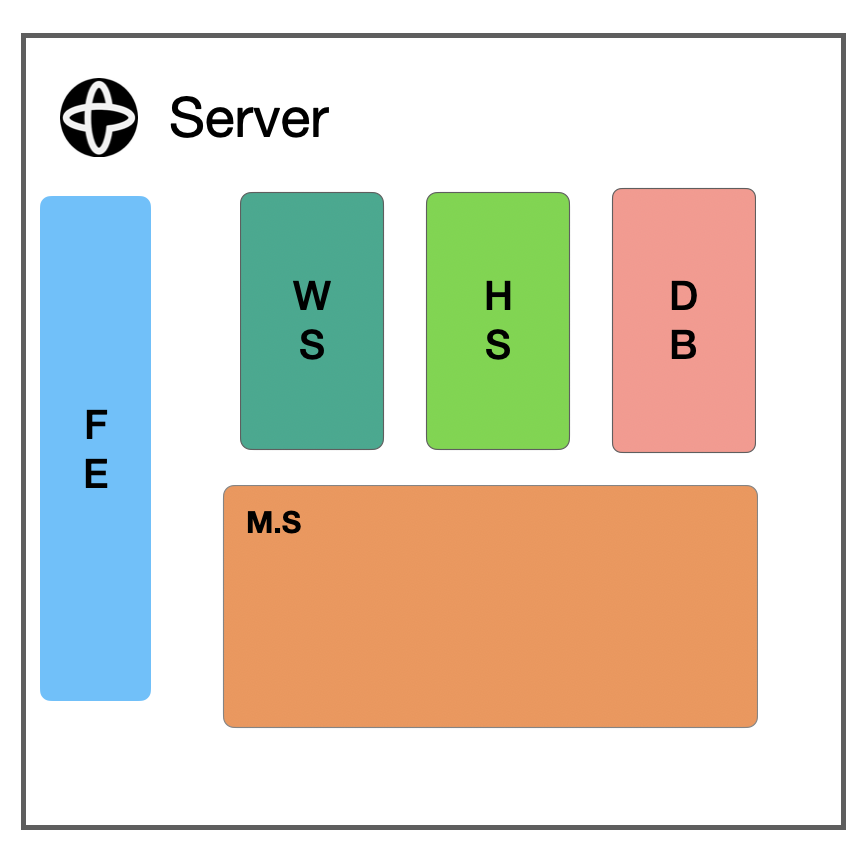
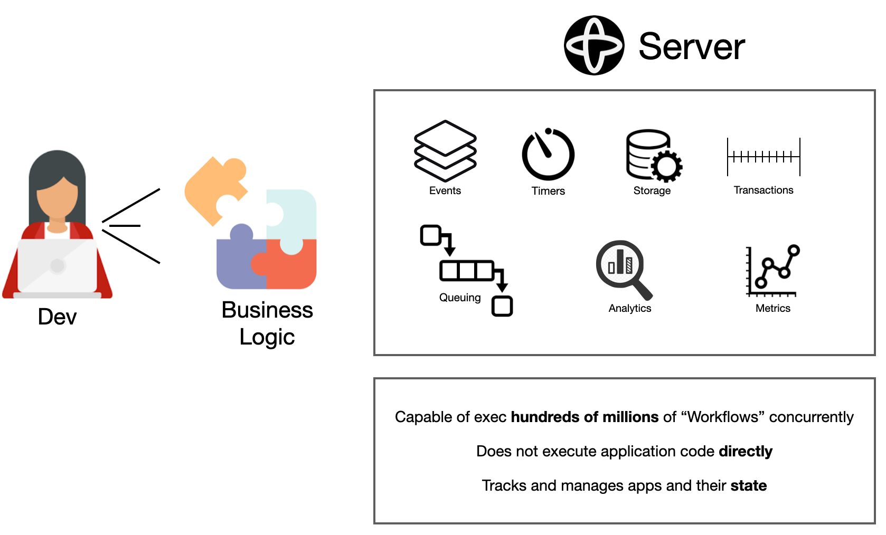
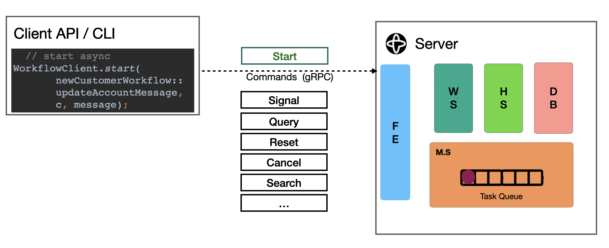

# Java SDK Workshop - Chapter 1 - Getting Started

* [Section 1 - Setting up](#Section-1)
* [Section 2 - Workflows](#Section-2)
* [Section 3 - Workers](#Section-3)  
* [Section 4 - Activities](#Section-4)
* [Section 5 - Child Workflows](#Section-5)
* [Section 6 - Testing](#Section-6)

<p align="center">
 <a href="https://www.youtube.com/watch?v=VoSiIwkvuX0"></a>
</p>

# Section 1
## Setting up 

* Java (version 8 or higher)
* Maven / Gradle 
  * [Apache Maven](https://maven.apache.org/download.cgi) 
  * [Gradle](https://gradle.org/)
* [Git](https://git-scm.com/book/en/v2/Getting-Started-Installing-Git) 
* [Docker Compose](https://docs.docker.com/compose/install/) 
    * [Video](https://www.youtube.com/watch?v=f6N3ZcWHygU)
* IDE (IntelliJ, VSCode, Eclipse, ...)

## Temporal Java SDK

* Provided APIs:
    * Client
    * Workflow
    * Testing

1. [GitHub Repo](https://github.com/temporalio/sdk-java)
2. [Maven Central](https://search.maven.org/search?q=io.temporal)
3. [Javadoc.io](https://www.javadoc.io/doc/io.temporal/temporal-sdk/latest/index.html)
4. [Java Samples](https://github.com/temporalio/samples-java)
5. APIs
    * Client
    * Workflow
    * Testing   
  
## Using SDK

* Main Dependency

Maven:   
```
<dependency>
    <groupId>io.temporal</groupId>
    <artifactId>temporal-sdk</artifactId>
    <version>${version.temporal}</version>
</dependency>
```

Gradle:
```
implementation group: 'io.temporal', name: 'temporal-sdk', version: '1.4.0'
```

* Test dependencies

Maven:
```
<dependency>
    <groupId>io.temporal</groupId>
    <artifactId>temporal-testing</artifactId>
    <scope>test</scope>
    <version>${version.temporal}</version>
</dependency>

<dependency>
    <groupId>io.temporal</groupId>
    <artifactId>temporal-testing-junit4</artifactId>
    <scope>test</scope>
    <version>${version.temporal}</version>
</dependency>

<dependency>
    <groupId>io.temporal</groupId>
    <artifactId>temporal-testing-junit5</artifactId>
    <scope>test</scope>
    <version>${version.temporal}</version>
</dependency>
```

Gradle:
```
 testImplementation group: 'io.temporal', name: 'temporal-testing', version: '1.4.0'
 testImplementation group: 'io.temporal', name: 'temporal-testing-junit4', version: '1.4.0'
 testImplementation group: 'io.temporal', name: 'temporal-testing-junit5', version: '1.4.0'
```

* [Simple Maven Archetype](https://github.com/tsurdilo/temporal-simple-archetype)

## Temporal Server

* Server Components


* From dev perspective



* [Github Repo](https://github.com/temporalio/temporal)


* Run on Docker Compose

```
git clone git@github.com:temporalio/docker-compose.git
cd docker-compose
docker-compose -f docker-compose-cass-es.yml up
```   

Note: for workshop samples to all run we need Elasticsearch enabled

* [Temporal Docker Compose GitHub Repo](https://github.com/temporalio/docker-compose)
* [Temporal Helm Charts Repo](https://github.com/temporalio/helm-charts)
* [Installing and Running Temporal Server on Docker Compose and Minikube Video](https://www.youtube.com/watch?v=f6N3ZcWHygU)

* Look at [Web UI](http://localhost:8088/)
* Useful Docker commands for cleaning up **DEV** environment:
  (note stop the Temporal server before you run this :) )
```
docker system prune -a
docker volume prune
```

## tctl

* [Documentation](https://docs.temporal.io/docs/system-tools/tctl/)

* Install CLI via HomeBrew:

```
brew install tctl
``` 

* [Other ways to install](https://docs.temporal.io/docs/system-tools/tctl/#run-the-cli)

* Check tctl version:

```
tctl -version
``` 

* Check cluster health:

```
tctl cluster health
```

# Section 2

## Workflows

* Programming-language model
    * [Defining Workflows Blog](https://docs.temporal.io/blog/defining-workflows)

* [GreetingStarter Workflow](c1s1/GreetingStarters)
    * Workflow Interface - @WorkflowInterface
    * Workflow Type
    * Workflow method -  @WorkflowMethod
    * Signal methods - @SignalMethod
    * Query methods - @QueryMethod
    * Workflow Implementation
    * Logger - Workflow.getLogger
    * WorkflowInfo - Workflow.getInfo

* Workflow Features
    * Have state
    * Can be long-running
    * Are fault-tolerant
    * Can be resumed in case of failures (infra, etc)
    * Can be invoked sync/async via SDK client apis
    * Can be multi-threaded
    
* Workflow "magic" - Durability (ability to resume after failure)
  * [Durability demo (PHP -> Java)](https://community.temporal.io/t/temporal-workflow-resumability/2838/3)
    * To run demo:
```
cd notifyuserphp
./rr serve
php app.php notification

# stop worker (rr serve window) like in the middle of the 10 customer iterations
#continue workflow exection on the Java side by running

io.workshop.intro.NotifyUserWorker

# check the final state of completed workflow with

io.workshop.intro.GetFinalCount
``` 
  * How? 
    * Temporal uses [Event Sourcing pattern](https://martinfowler.com/eaaDev/EventSourcing.html)
        * All changes during workflow execution are recorded as events
        * Events can be replayed to restore state after failure
        * Temporal optimizations (caching)
  * "Magic" comes at a price:
    * workflows must be deterministic
    * workflows api has implementation constraints
    
* [Implementation Constraints](https://docs.temporal.io/docs/java/workflows#workflow-implementation-constraints)
    * Dont' use mutable global state
    * Don't ue explicit synchronization
    * Static Fields
        * io.temporal.workflow.WorkflowLocal
        * io.temporal.workflow.WorkflowThreadLocal
    * Don't use synchronized lists
    * Don't use unordered collections (when iterating data and calling activity / child workflow for each data element)
    * Don't use non-deterministic functions (random nums, uuid, etc), rather use:
        * Workflow.newRandom()
        * Workflow.randomUUID()
        * [Workflow.sideEffect(...)](https://github.com/temporalio/samples-java/blob/master/src/main/java/io/temporal/samples/hello/HelloSideEffect.java#L135)
    * Don't use native Java Threads / ExecutorService (no Thread.sleep, sorry :) ), but rather
        * Async.function(...)
        * Async.procedure(...)
        * Workflow.sleep

* What about scalability of workflows?
  * Temporal scales out with the number of workflow executions (instances)
  * Tested up to a couple of hundred million open workflows (can go much higher)
  * Temporal does not scale up the size of single workflow execution.
    
* Workflow limitations:
    * Input / Results
      * [2MB Max / 256KB Warning](https://github.com/temporalio/temporal/blob/37799989ae6ff0e32be7f8803fb0b6d7b6eb1087/service/history/configs/config.go#L386)
    * History size
        * 50K Events in history / warning each 10K
        * Can mitigate this via [continueAsNew](https://docs.temporal.io/docs/java/workflows/#large-event-histories) and also child workflows

* Workflow Statuses:
    * Running
    * Completed
    * Failed
    * Cancelled
    * Terminated
    * ContinuedAsNew
    * TimedOut
    
* Retention Period:
    * Min: 1 day
    * Max: 30 days
    * Default: 2 days
    

## Interacting with workflows



* gRPC communication to Temporal server
* Workflow client stub
* WorkflowStub - client side stub to a single workflow instance
* Different ways of starting workflow executions
* Core concepts: namespace, task queue, poller/worker
* Namespace:
 * Unit of isolation
* Task Queue - "Endpoint" 
* Pollers/Workers - Processes (running on your machines) that listen to task queues

* Polyglot
   * [Demo 1](https://github.com/temporalio/temporal-polyglot)
   * [Demo 2](https://github.com/temporalio/temporal-pendulum)
   * [Demo 3](https://github.com/tsurdilo/temporal-polyglot-snake)

* WorkflowServiceStubs
* WorkflowService
* Workflow stubs
* [Workflow Options](https://github.com/tsurdilo/temporal-sdk-options/tree/main/java#workflowoptions)
  * Workflow Id
  * Task Queue
* Starting workflows
    * typed
        * sync / async
    * cron
      * limited, but can write own:
        * [Periodic execution](https://github.com/temporalio/samples-java/tree/master/src/main/java/io/temporal/samples/updatabletimer)
        * [Updatable timer](https://github.com/temporalio/samples-java/blob/master/src/main/java/io/temporal/samples/hello/HelloPeriodic.java)
    * untyped
    * async
        * Workflow.execute
        * Workflow.start
        * Async start then call blocking stub
        * From a different process
    * signalwithstart
* Dealing with exceptions (not extending TemporalFailure)
    * Workflows do not fail on unknown exceptions (by default)
    * Unknown exceptions are treated as a bug (can be fixed), not failing workflow
    * WorkflowImplementationOptions - if need to fail on unknown exceptions 
    * WorkflowFailedException indicates workflow failed
* Exceptions in Workflows:
    * If exception extends TemporalFailure
        * Workflow fails
        * Workflow is retried (from beginning) only if Workflow retry options are specified
    * Exception does not extend TemporalFailure
        * Is specified in WorkflowImplementationOptions
            * Workflow is retried (from beginning) only if Workflow retry options are specified
        * Is not specified in WorkflowImplementationOptions
            * Workflow replays (from history) up until workflow run timeout (waits for fix)
* Workflow retries
    * Each retry is a new workflow run (new runid)
* Workflow reset
    *  Currently supports only resetting to WorkflowTaskStarted
* Terminating workflows
* Signalling workflows
* Querying workflows

<p align="center">

</p>

* In Web UI
    * Discuss namespace
    * Discuss task queue / pollers
    * Discuss Workflow execution identity
    * Discuss long-running workflow
* Discuss polyglot aspect of Temporal (in terms of client)

## Search Attributes
* Custom key-value pairs
* Can be added to workflow metadata
* Integrated with Elasticsearch
* Some pre-defined search attributes exist:
    * ```tctl cluster get-search-attributes```
* Can be added / changed after workflow starts

* Add search attributes via tctl:
```
tctl admin cluster add-search-attributes --name CustomerTitle --type Text
tctl admin cluster add-search-attributes --name CustomerLanguages --type Text
tctl admin cluster add-search-attributes --name CustomerAge --type Int
```

# Section 3

## Workers

* WorkerFactory
* WorkerOptions
* Worker
    * TaskQueue
    * Register Workflow impls


# Section 4

## Activities

* Yay, we can finally use Thread.sleep :) 

* "Workhorses"
   * Orchestrated by workflows
   * Allowed to contain any code (integration with libraries, services, io, db, etc etc)
   * [Activity Options](https://github.com/tsurdilo/temporal-sdk-options/tree/main/java#activityoptions)
   * Automatic retries (can be configured)
   * [Activity Timeouts Explained](https://www.youtube.com/watch?v=JK7WLK3ZSu8)
   * Can be executed async and  parallel
   * Must be registered with worker (activity instance)
        * Activities must be thread safe!
   * Logic can be changed without breaking determinism
   * Inputs and results recorded in event history
   * Can heartbeat
   * Can be manually completed

* @ActivityInterface
* @ActivityMethod (not really needed, type defaults to method name)

* Limitations
 * Similar to workflows (data input / output size)

* Compensation (SAGA)

# Section 5

## Child Workflows

* Are workflows too :) 
* Invoked from "parent" workflows
* Can have own timeouts
* Can be scheduled (cron)
* Parent can define ParentClosePolicy (default terminate)

# Section 6

## Testing

* Workflows - TestWorkflowEnvironment
* Activities - TestActivityEnvironment

* Does not need Temporal Server to be running (can test offline)

* Test workflow with real activities
* Mock activities
* Time advance
* Workflow replay from history
* Json event history via tctl:

```
tctl wf show -w <WF Type> -r <WF Run Id> --output_filename myfile.json
```

* Debugging - set env var "TEMPORAL_DEBUG" to true

