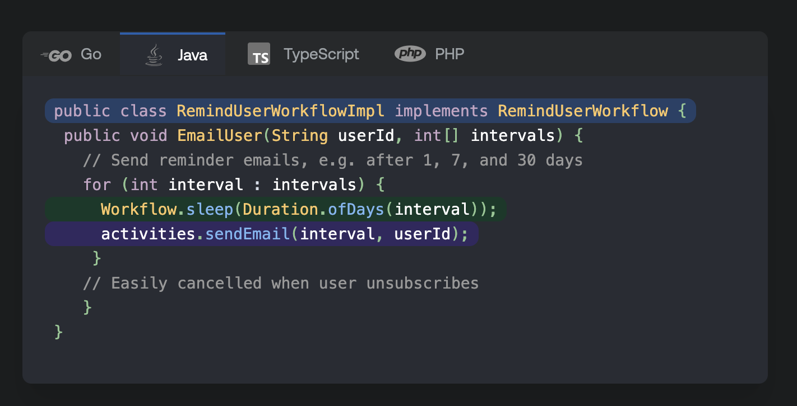

# Java SDK Workshop - Chapter 2 - Client APIs, Versioning and Error Handling

* [Section 1 - Client APIs continued](#Section-1)
* [Section 2 - Sleep Duration](#Section-2)
* [Section 3 - Versioning](#Section-3)
* [Section 4 - Error Handling](#Section-4)
* [Section 5 - Dynamic Workflow / Activities](#Section-5)

# Section 1

## Client APIs Continued

* List Opened Workflows - does NOT require Elasticsearch
    * tctl wf list --open
* List Closed Workflows
    * tctl wf list --status completed
* Describe wf execution
    * tctl wf desc -w <wfid> -r <wfrunid>
* Print wf stack trace
    * tctl wf stack -w <wfid> -r <wfrunid>
* Get workflow cron schedule
* Get Activities with retry count over X
* List Namespaces
  * tctl namespace list
* Create Namespace
  * tctl --ns mynamespace n re
* Check cluster (FrontEnd Service health)
  * tctl cluster health
* Describe task queue
  * tctl tq desc -tq <task_queue_name>

# Section 2

## Sleep Duration

In this section we are going to take a look at "simple" Workflow.sleep
and will learn how to get the most out of it in cases of failures, or workers being down

# Section 3

## Versioning 

1. Show how we can fix activity code to unblock workflow execution
2. Show version sample

** Current limitations for Java SDK:
  * https://github.com/temporalio/sdk-java/issues/587 - TemporalChangeVersion search attribute not updated in Java SDK
  * To Show search attributes: tctl cluster get-search-attributes
  * tctl workflow count --query='TemporalChangeVersion="<change_id>-<version>" AND ExecutionStatus=1'
  * tctl workflow list --query='TemporalChangeVersion="<change_id>-<version>" AND ExecutionStatus=1'

# Section 4

## Error Handling

* Handling workflow timeouts
* Handling workflow errors
* Handling Activity timeouts in wf code
* Handling Activity errors in wf code
* Handling Activity errors in child wf and wf code

Notes:
* Workflows don't have retry options - not retried when failed or timed out
* Any exception that doesn’t extend TemporalFailure is converted to ApplicationFailure when thrown from a workflow or an activity.
* A syncronous workflow invocation always returns WorkflowException that contains original failure as cause
* Calls to activities always throw ActivityFailure with an exception that caused the failure as a cause. 
* Calls to child workflows always throw ChildWorkflowFailure with original failure as a cause

Notable cases:
1. Workflow code throws exception that extends TemporalFailure: 
 - Workflow fails. Workflow is retried (by executing it from beginning) only if retry options are specified.
   
2. Workflow code throws exception that does not extend TemporalFailure, but it does specify it in WorkflowImplementationOptions.setFailWorkflowExceptionTypes
 - same as (1)

3. How are workflow retries modeled? 
 - It's modeled as a new workflow run. It gets a new run id. The previous run data (event history) is available
up to the set retention period.

4. Workflow code throws Exception that does not extend TemporalFailure and is not specified in WorkflowImplementationOptions.setFailWorkflowExceptionTypes
 - Workflow task is replayed until we hit a timeout (wf run/execution), waiting for a fix.

# Section 5

## Dynamic Workflow / Activities

* Dynamic Workflow impl
* Dynamic Activity impl
* Show how to start, signal and query dynamic wf